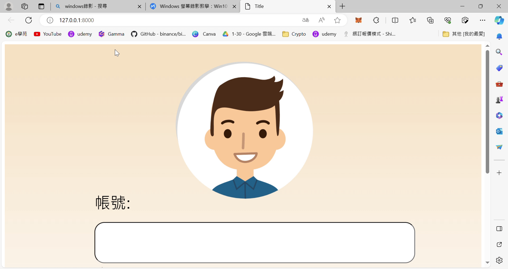

# Django 預約系統練習

這是使用 Django 框架實作的預約系統，主要作為練習專案。此系統可以讓使用者進行簡單的預約操作，適合用來學習 Django 的基礎功能。

### 功能概述

- 用戶可以進行預約操作。
- 提供簡單的用戶介面來選擇日期和時間進行預約。
- 支援基本的資料庫操作，包含新增、更新、刪除預約記錄。

### 環境安裝
  'conda activate mvc'
  'pip install -r requirements.txt'
  'python manage.py migrate'
  'python manage.py runserver'

### Demo

